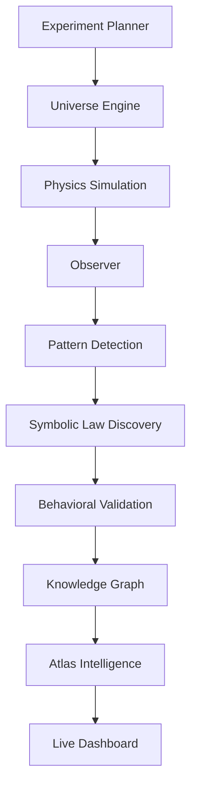

# Physics-AI

**Physics-AI** is an experimental platform for automated discovery of physical laws from simulated universes.

Instead of training on static datasets, Physics-AI generates synthetic physical worlds, observes their behavior, detects emergent structures, and infers governing equations using symbolic regression and validation loops. The system is designed as a **physics-first machine scientist** for exploring nonlinear dynamical systems and uncovering candidate laws.

## Core idea

Physics-AI implements a closed scientific discovery loop:

```
Generate universes
	-> Simulate fields and dynamics
	-> Observe structures and metrics
	-> Detect patterns (particles, waves, defects)
	-> Infer candidate equations
	-> Re-simulate inferred laws
	-> Validate physical behavior
	-> Store discoveries in a knowledge graph
	-> Explore discoveries in a live dashboard
```

## Key features

### Universe generation

Physics-AI can generate many classes of universes:

- random fields
- spectral eigenmode universes
- harmonic universes
- golden-ratio resonance universes
- geometry-driven universes

Supported dynamics include:

- static
- wave equation
- diffusion
- reaction-diffusion
- Schrodinger equation
- spectral Lagrangian systems
- geometry curvature dynamics

### Multi-field simulations

The engine supports coupled fields ($\psi$, $\phi$) with cross-terms such as:

```
psi*phi
psi^2*phi
phi^2*psi
```

This enables discovery of interaction-driven regimes.

### Emergent structure detection

Observers analyze simulation frames and extract:

- vortex count
- nodal loops
- defect density
- coherence length
- spectral entropy
- resonance peaks

The engine can detect particle-like structures, solitons, interference patterns, nonlinear interactions, and particle collisions.

### Symbolic law discovery

The system attempts to infer governing equations from observed signals. Example output:

```
dpsi/dt = -0.98 psi + 0.51 psi^3
```

The symbolic discovery engine:

- builds an operator library
- fits sparse regression models
- evaluates candidate equations
- performs behavioral validation

Spatial operators include:

```
psi
psi^3
psi^5
laplacian(psi)
biharmonic(psi)
abs(psi)^2 * psi
psi*phi
psi^2*phi
```

### Behavioral validation

Discovered equations are validated by re-simulating the system and comparing:

- defect density
- spectral entropy
- vortex count
- cross-field correlation
- temporal structure

This produces:

```
law_fit_score
law_validation_score
law_regime_match_score
law_coupled_match_score
```

### Knowledge graph of discoveries

All discoveries are stored in a lightweight concept graph. Relations include:

```
field --emergent_particle--> particle
particle --interaction--> particle
dynamics --lagrangian--> equation
symmetry --conserves--> quantity
resonance --dispersion_law--> relation
theory --compressed--> equation
```

Graph exports include:

```
graph_summary.json
graph_relations.json
```

### Universe atlas

Physics-AI builds a map of discovered regimes with:

- UMAP / t-SNE embedding
- regime clustering
- novelty detection
- density-based surprise detection
- behavioral clustering

This atlas acts as a map of nonlinear physics regimes.

### Live dashboard

A Streamlit dashboard allows interactive exploration. Panels include:

- Universe Atlas
- Regime Explorer
- Regime Compare
- Law Discovery
- Resonance Ratios
- Atlas Statistics
- Knowledge Graph Explorer

Example launch:

```bash
streamlit run physics_ai/live_dashboard.py -- --run-dir experiments
```

### Dashboard screenshots

Add images under `docs/screenshots/` and reference them here. Suggested names:

- `docs/screenshots/atlas.png`
- `docs/screenshots/regime_explorer.png`
- `docs/screenshots/knowledge_graph.png`

## Project architecture



The source diagram lives in `docs/architecture.mmd`.

```
physics_ai/
|
|-- universe_engine.py        universe generation
|-- field_dynamics.py         PDE dynamics
|-- simulation.py             grid simulation
|
|-- observer.py               structure metrics
|-- defect_detector.py        topology detection
|-- particle_detector.py      emergent particles
|-- interaction_detector.py   particle interactions
|
|-- symbolic_law_extractor.py symbolic regression
|-- operator_library.py       operator generation
|-- law_validator.py          behavioral validation
|
|-- regime_clustering.py      structural clustering
|-- behavior_clustering.py    behavioral clustering
|-- regime_summarizer.py      regime labeling
|
|-- universe_atlas.py         regime embedding
|-- live_dashboard.py         Streamlit dashboard
|
|-- knowledge_graph.py        discovery graph
|-- checkpoint.py             experiment persistence
|
|-- evolutionary_runner.py    evolutionary search
|-- distributed_runner.py     distributed simulation
```

## Quick start

Create environment:

```bash
python -m venv .venv
source .venv/bin/activate
pip install -r requirements.txt
```

Run a discovery experiment:

```bash
python -m physics_ai.main_loop
```

Run a wave universe:

```bash
python -m physics_ai.main_loop --dynamics-type wave
```

Launch the dashboard:

```bash
streamlit run physics_ai/live_dashboard.py -- --run-dir experiments
```

Run tests:

```bash
pytest -q
```

## Evolutionary universe search

The engine can evolve universes across generations:

```bash
python -m physics_ai.evolutionary_runner \
	--generations 3 \
	--population-size 20 \
	--elite-count 5 \
	--dynamics-type wave
```

This mutates high-scoring universes to explore promising regions of the physics space.

## Distributed discovery

Experiments can be parallelized:

```bash
python -m physics_ai.distributed_runner \
	--universe-count 256 \
	--batch-size 64
```

Ray can be used for cluster execution.

## Canonical physics rediscovery

Physics-AI includes benchmarks for rediscovering known systems:

```bash
python -m physics_ai.canonical_runner
```

Target systems include:

- harmonic oscillator
- diffusion equation
- wave equation
- Schrodinger equation

## Research goals

Physics-AI explores whether automated systems can:

- rediscover known physical laws
- discover new nonlinear regimes
- classify universality classes
- infer Lagrangians
- detect conserved quantities
- map the space of dynamical systems

## Status

This repository is a research prototype exploring automated physics discovery. The architecture is modular and designed to support large-scale universe exploration, symbolic discovery loops, and human-in-the-loop inspection.

## License

TBD

## Future directions

Potential extensions include:

- GPU simulation
- multi-scale renormalization
- symmetry discovery
- automated theorem extraction
- large-scale atlas construction

## Citation

If you use this repository for research, please cite:

```
Physics-AI: Automated Discovery of Physical Laws from Simulated Universes
```

## Author

Greg
Founder of CodeNLighten
